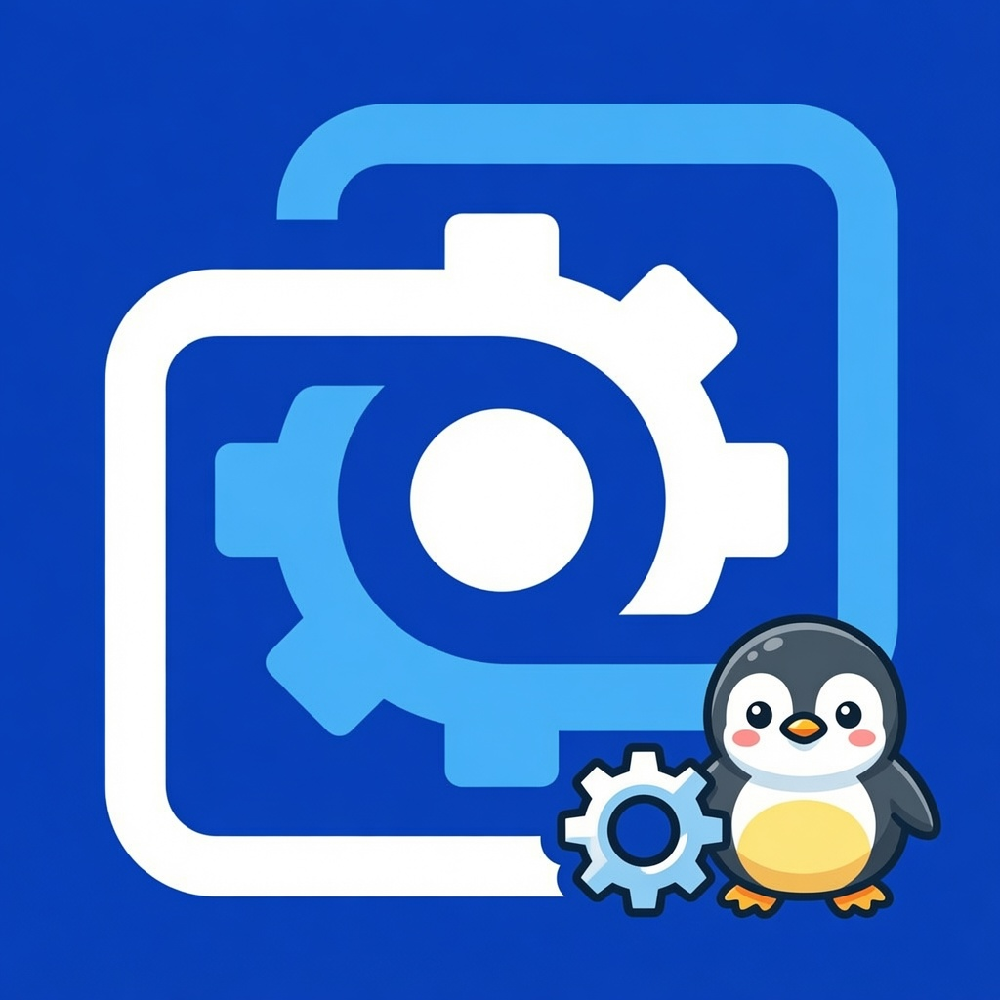

<p align="center">
  
</p>

<h1 align="center">WePapered</h1>

<p align="center"><b>Wallpaper Engine, running natively on Linux.</b></p>

---

## What it is

WePapered lets you use your Wallpaper Engine wallpapers on Linux, rendered
**natively**. You browse and pick wallpapers in WePapered's own window, and your
choice is drawn straight onto your desktop — smooth, per-monitor, with nothing
left running in the background to keep it on screen. **No Proton**, no Wallpaper
Engine process kept alive.

Animated scenes, videos, images and interactive web wallpapers all work, and
your picks are remembered across reboots.

## Install

One command, any distro:

```bash
curl -fsSL https://raw.githubusercontent.com/arca-inc/wepapered/master/install.sh | sh
```

This downloads a ready-to-run, self-contained build and installs it for your
user (under `~/.local`, no root needed). Useful options:

```bash
curl -fsSL .../install.sh | sh -s -- --system      # install for all users (/usr/local)
curl -fsSL .../install.sh | sh -s -- --uninstall   # remove it
```

**Arch Linux:** available on the [AUR](https://aur.archlinux.org/) — install it
with your preferred helper (`yay`, `paru`, …):

```bash
yay -S wepapered-bin      # prebuilt bundle (fast)
yay -S wepapered-git      # build from source
```

**Build it yourself:** see [Build from source](#build-from-source) below.

## Prerequisites

**Required**

- A **legitimate copy of Wallpaper Engine**, owned and installed through
  **Steam**. WePapered uses its installed files (the browse interface and your
  wallpapers) — it does **not** run Wallpaper Engine, and Proton is not needed.
- **Hyprland** on a **Wayland** session (`hyprctl` is used to read your monitors).
  Support for more window managers / desktop environments is planned.
- An audio server — **PipeWire** or **PulseAudio** (`pactl`) — for audio-reactive
  wallpapers and choosing the capture source.

**Optional**

- **playerctl** — shows the current track ("now playing") on wallpapers that
  support media integration.
- A notification daemon (`notify-send` / libnotify) — desktop notifications when
  a wallpaper is applied.
- **Steam Web API key** (free) — to browse the Workshop; add it in **Settings**.

The host graphics libraries WePapered needs (gtk3, webkit2gtk, nss) are installed
for you by the install script.

## Supported environment

| | Status |
|---|---|
| **Hyprland** on **Wayland** (x86_64) | ✅ Supported |
| **GNOME** on **Wayland** | ❌ Implemented in `feature/gnome-support` branch, but unsupported natively due to GNOME forbidding Layer Shells. |
| Other window managers / desktops | 🚧 Planned |

> **Note on GNOME Compatibility:** Monitor detection for GNOME has been implemented and is available in the `feature/gnome-support` branch. However, GNOME's compositor (Mutter) actively forbids and does not implement the Wayland Layer Shell protocol (`wlr-layer-shell`), which WePapered relies on to draw the wallpaper behind your desktop icons. Without a third-party extension to forcefully polyfill layer shell support, WePapered cannot function as a true wallpaper engine on GNOME Wayland.


## How to use

**1. Start the WePapered daemon at login.** It renders the wallpapers and serves
the browse window.

- **Hyprland** — add it to your config so it starts with your session:

  ```ini
  # hyprland.conf
  exec-once = wepaperedctl daemon
  ```

  Using a JavaScript-based Hyprland config instead:

  ```lua
  hl.on("hyprland.start", function ()
    hl.exec_cmd("wepaperedctl daemon")
  end)
  ```

- **Any other setup** — enable the bundled service, or see your compositor's
  autostart documentation:

  ```bash
  systemctl --user enable --now wepapered
  ```

**2. Browse and pick.** Open the browse window and choose wallpapers in
Wallpaper Engine's real UI, via WePapered Gui:

```bash
wepaperedctl gui        # or the "Wepapered" app launcher, or the tray icon
```

**3. Tweak settings** (Wallpaper Engine path, Steam API key, theme):

```bash
wepaperedctl settings   # or the "Wepapered Settings" app launcher, or the tray icon
```

> First-run tip: WePapered auto-detects your Wallpaper Engine install from the
> usual Steam locations. To browse the Workshop, add a free Steam Web API key in
> **Settings** (there's a `?` link next to the field that opens Steam's page).

## How it works

```
Wallpaper Engine UI  ──►  WePapered daemon  ──►  native render, one per monitor
   (you pick here)         (intercepts pick)        (linux-wallpaperengine)
```

You pick a wallpaper in Wallpaper Engine's own interface. WePapered intercepts
that selection, resolves it, and draws it natively on each monitor — one
lightweight renderer per output. Nothing from Wallpaper Engine stays running to
display the wallpaper, and your choices are written back so the two stay in sync.

The native rendering is done by a **custom, patched build of
linux-wallpaperengine**, based on the excellent work of
[**Almamu**](https://github.com/Almamu) and the
[linux-wallpaperengine](https://github.com/Almamu/linux-wallpaperengine) project
(GPL). WePapered's fork adds the bits it needs (the hot-swap / control protocol,
web-GPU backend selection, and a few rendering fixes) on top — full credit for the
engine goes to the upstream author and contributors.

## Build from source

WePapered links a prebuilt copy of the linux-wallpaperengine library (the `lwe`
submodule), so build that first, then the four binaries:

```bash
git clone https://github.com/arca-inc/wepapered
cd wepapered

git submodule update --init --recursive          # first checkout only

cd lwe && mkdir -p build && cd build              # build the LWE library + helpers
cmake -DCMAKE_BUILD_TYPE=Release ..
make
cd ../..

make                                              # → bin/{wepapered-daemon,-gui,-settings,wepaperedctl}
```

Needs Go (1.21+), CMake, a C/C++ toolchain, and the GTK3 + webkit2gtk-4.1 dev
packages.

## Project

- Roadmap / known issues: [TODO.md](TODO.md)
- Who maintains what: [MAINTAINERS.md](MAINTAINERS.md)
- License: [MIT](LICENSE). The bundled rendering engine
  ([linux-wallpaperengine](https://github.com/Almamu/linux-wallpaperengine)) is
  GPL and keeps its own license.
